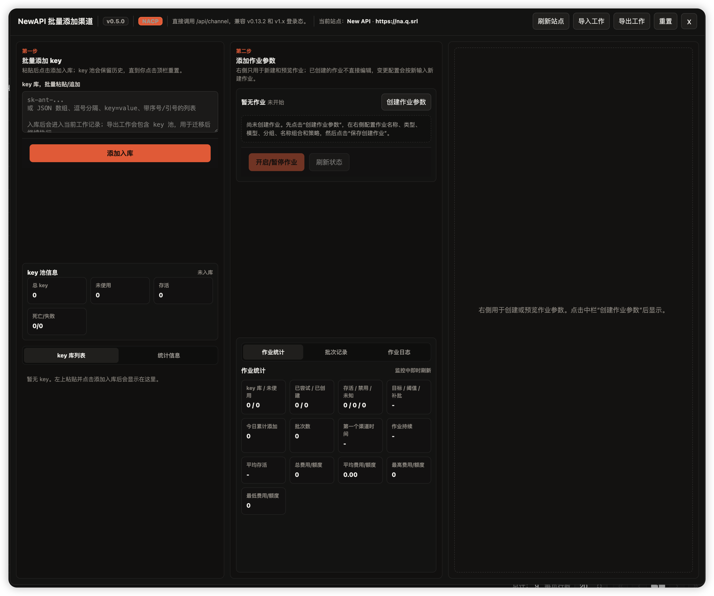

# NAHS - NewAPI Helper Suite

NAHS（NewAPI Helper Suite）是一个面向 NewAPI 管理后台的油猴脚本辅助工具箱。

当前版本的第一个工具模块是“批量添加渠道 / key 池作业”：可以批量入库 provider key，按作业参数创建渠道，并持续监控存活数量，低于阈值时自动从 key 池补充新渠道。

## 安装

安装 Tampermonkey / Violentmonkey 后，打开下面的 raw 地址安装：

```text
https://raw.githubusercontent.com/LickJCR/NAHS/main/newapi-helper-suite.user.js
```

## 当前功能

- 支持 NewAPI v0.13.2 和 v1.x 登录态。
- 直接调用 `/api/channel` 创建渠道。
- 支持 key 池入库、去重、状态统计和工作记录持久化。
- 支持创建作业后持续监控渠道状态。
- 支持保活数量、低于阈值、补充数量、监控间隔等策略参数。
- 支持按渠道类型读取分组、样板渠道、模型和模型映射。
- 支持自定义名称组合：固定文本、顺序数字、顺序字母、随机码、时间戳、日期、key 前缀。
- 支持导入 / 导出工作记录，迁移后继续执行。

## 界面预览



## 规划

这个项目会逐步扩展为 NewAPI 辅助工具箱，而不是只做批量添加。

- 日志错误监控。
- 关键事件声音提醒。
- 渠道异常报警。
- 额度 / 费用 / 存活时间统计看板。
- 作业历史分析和本地日志导出。
- 更多 NewAPI 管理后台辅助操作。

## 使用说明

1. 在已登录的 NewAPI 管理后台进入渠道页面，例如 `/channels` 或 `/channel`。
2. 点击页面上的 `批量渠道 / NACP` 浮动按钮打开工作台；按钮可以拖动调整位置。
3. 在左侧 `key 库` 粘贴 provider key，点击“添加入库”。支持逐行、逗号分隔、JSON 数组、`key=value`、带序号或引号的列表；key 会先进入当前站点的本地 key 池。
4. 在中栏点击“创建作业参数”，打开右侧作业配置区。
5. 在右侧配置渠道类型、分组、模型、模型映射、名称组合、优先级、权重、标签、备注和高级 JSON 字段。也可以点击刷新分组 / 样板渠道，从当前 NewAPI 站点读取已有配置作为参考。
6. 配置策略：`保活` 是目标存活数量，`低于` 是触发补货阈值，`添加` 是每次补充数量，`间隔` 是自动监控周期。
7. 点击“刷新预览”确认渠道名称和 key 解析结果，必要时可复制首条 payload 检查提交内容。
8. 点击“保存创建作业”。脚本会先按保活数量创建首批渠道，然后定时刷新渠道状态；当存活数量低于阈值时，会从 key 池继续补充。
9. 作业创建后，可在中栏查看作业统计、批次记录和作业日志；也可以暂停 / 开启作业、手动刷新状态，或修改运行策略后点击“应用策略”。
10. 顶栏的“导出工作”会导出完整 key 池、作业和日志；“导入工作”可在其他浏览器或站点恢复；“重置”会清空当前工作记录。

key 池为空时也可以先创建作业，后续继续入库 key 后，作业会在自动监控时补货。

## 安全说明

- API key 不会写入脚本仓库。
- 工作记录默认保存在当前站点浏览器 localStorage。
- 导出工作记录时请自行保管文件，避免泄露 key 信息。

## License

MIT
